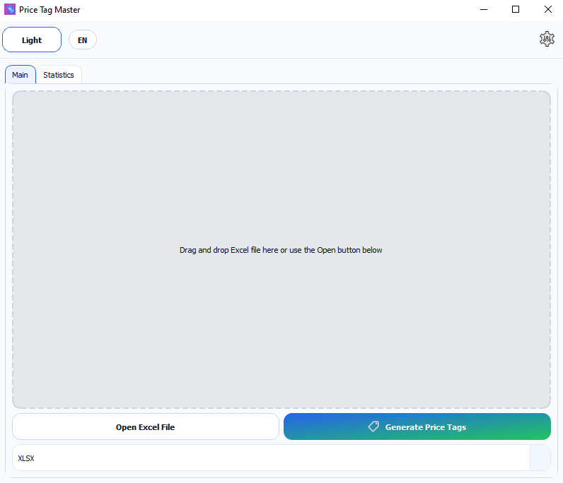
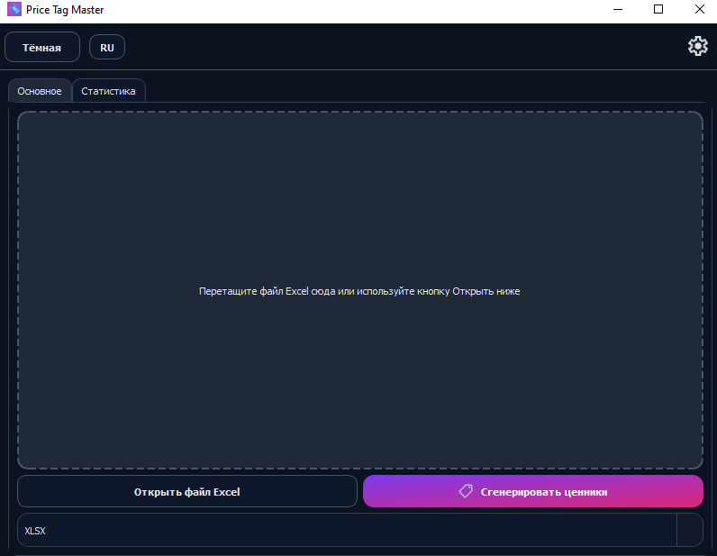
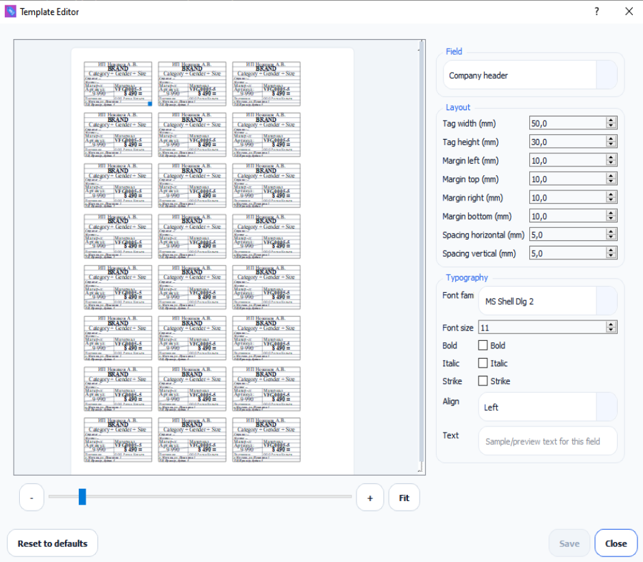
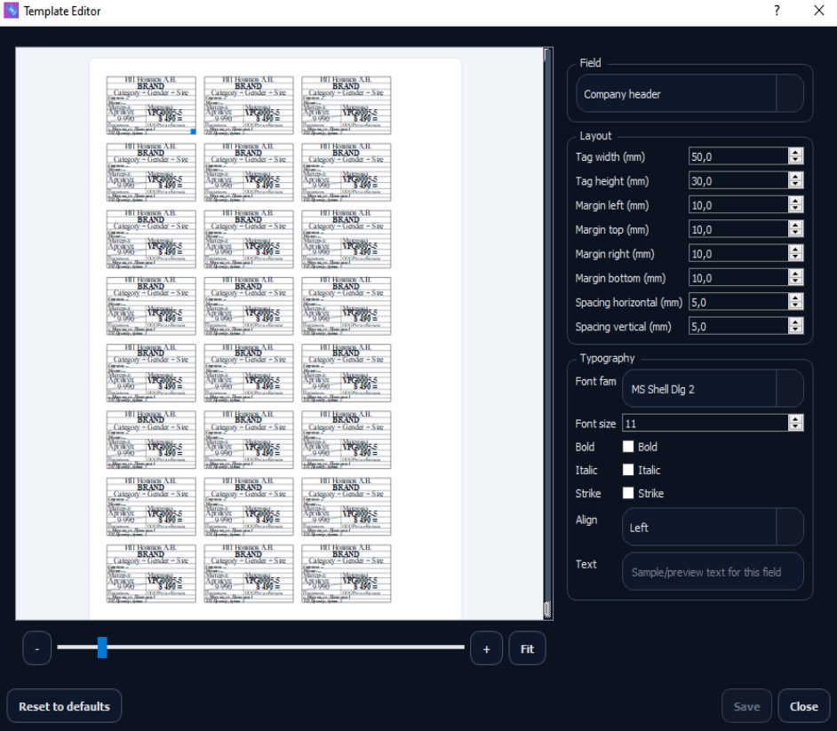
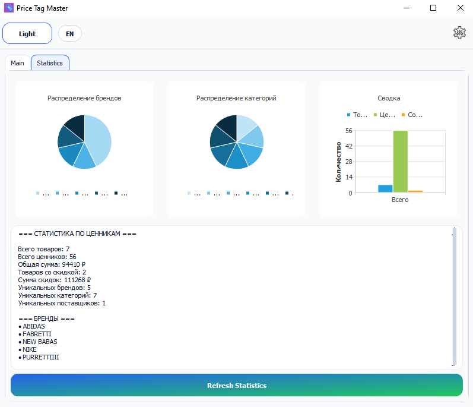
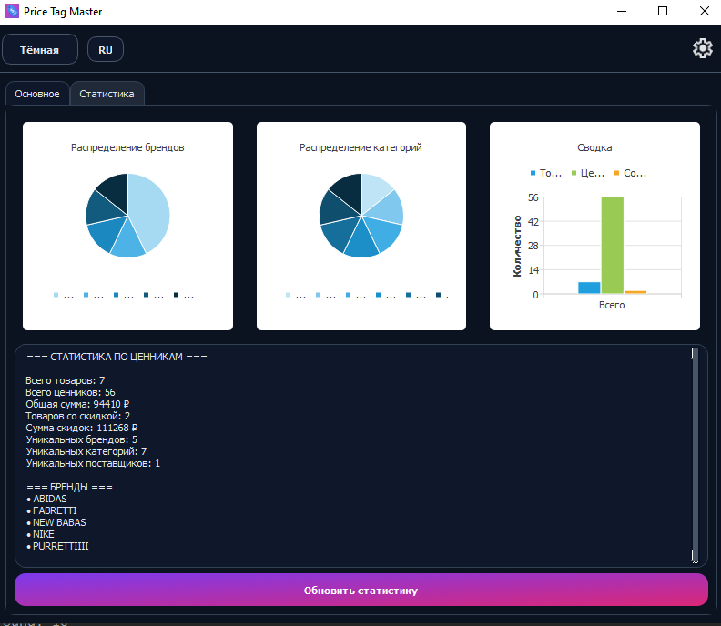

# PriceTagMaster — Your Ultimate Price Tag Generator! 🏷️✨

**Imagine this: Upload an Excel file with your invoice data, and boom — in seconds, you've got print-ready price tags on A4 paper!** No more tedious manual design — just style, speed, and professional results. PriceTagMaster is a powerful desktop app built with C++ v17 and Qt 6 that transforms your data into stunning price tags with flexible templates, live preview, and export to DOCX or XLSX. Perfect for retail, small businesses, and anyone dealing with products!

*Supports Windows 10+ and major Linux distributions. Minimal dependencies — just download and run!*

---

## 🌟 Why PriceTagMaster is Your Must-Have App?

- **🚀 Lightning-Fast Excel Import:** Drag-and-drop your Excel file or hit "Open Excel File." The app auto-detects headers (Supplier, Price, SKU, etc.) and populates tags instantly. Supports smart carry-down rules - values inherit downward automatically!
- **🎨 Flexible Template Editor:** Design and tweak your price tag layouts: sizes, fonts, colors, margins, and even millimeter-precision geometry. Real-time preview on A4 sheets with pagination!
- **📄 Export in a Flash:** Save to DOCX or XLSX with pinpoint accuracy (within 1mm). Fully printer-compatible - no clipping or distortions!
- **🌓 Light/Dark Themes:** Toggle between light and dark modes for eye comfort. The interface adapts to your vibe!
- **📊 Stats & Analytics:** Built-in charts show brand distribution, categories, and more - great for business insights!
- **🔧 Effortless to Use:** Intuitive interface with no fluff. English UI support, data validation, and gentle error notifications.

**Perfect for:** Sellers, store managers, entrepreneurs, and anyone tired of manual price tag creation. Save time and sanity - automate the grind!

---

## 🚀 Getting Started: Step-by-Step Guide

PriceTagMaster is super easy to use! Here's a quick walkthrough — from install to your first price tag. Follow along, and you're golden!

1. **Installation:**

   - Download the archive for your OS (Windows/Linux) from [our repo](https://example.com/download).
   - Unzip to any folder. No installer needed — it's portable!  
     **Our Icon:**  
       
     *Spot our sleek icon in your apps — it's unforgettable!*
   - Requirements: Windows 10+ or Linux (x86_64), 100MB space. Dependencies are baked in with Qt 6.
2. **First Launch:**

   - Run `PriceTagMaster.exe` (Windows) or `./PriceTagMaster` (Linux).
   - Pick your theme: Light or Dark in settings.
     - **Light Theme (Main Window):**  
         
       *Bright and clean — perfect for daytime work!*
     - **Dark Theme (Main Window):**  
         
       *Sleek and easy on the eyes for late-night sessions!*
3. **Load Your Data:**

   - Prep your Excel file with invoice data. Use headers like in our example (see `docs/OtherHelpfulFiles/ExcelAPI.txt`):
     - Supplier, Address, Brand, Category, Price, etc.
   - Drag the file into the drop zone or click "Open Excel File."
   - The app validates headers and shows tips if something's off (but keeps working with available data).
4. **Generate Price Tags:**

   - Open the "Template Editor" — here's how it looks:
     - **Light Theme (Template Editor):**  
         
       *Customize every detail with live preview!*
     - **Dark Theme (Template Editor):**  
         
       *Creative flow in the dark — pure inspiration!*
   - Tweak: tag size (mm), fonts, fields, colors.
   - Check the preview for A4 pagination — see how it fits!
   - Want stats? Head to "Statistics" for charts — check out these views:
     - **Light Theme (Statistics):**  
         
       *Analyze sales data with clarity!*
     - **Dark Theme (Statistics):**  
         
       *Insights that pop in the dark!*
5. **Export & Print:**

   - Choose format: DOCX (for Word) or XLSX (for Excel).
   - Pick a save path.
   - Open in Word/Excel and print on A4 — flawless results!

**Pro Tip:** Start with a test file from `docs/Examples/`. Check logs in `docs/WorkflowLogs/` if needed.

---

## 🛠️ Tech Details (For the Curious)

- **Tech Stack:** C++17, Qt 6 Widgets, CMake for builds.
- **Formats:** Import — XLSX; Export — DOCX/XLSX with A4 constraints.
- **Performance:** Handles 5,000+ rows in seconds.
- **Cool Features:** Carry-down logic, category merging, themes, live preview.
- Dive deeper in [PRD.md](docs/PRD.md) and [Implementation.md](docs/Implementation.md).

---

## 📝 License & Support

- **License:** Open-source (MIT). Use it freely!
- **Support:** Found a bug or have ideas? Hit up Issues on GitHub — we respond fast!
- **Credits:** Built by enthusiasts who love automation. Thanks for using! ❤️

**Ready to revolutionize your price tag printing? Download PriceTagMaster now and feel the difference!** 🚀
[Download Windows](https://example.com/download/windows) | [Download Linux](https://example.com/download/linux)
