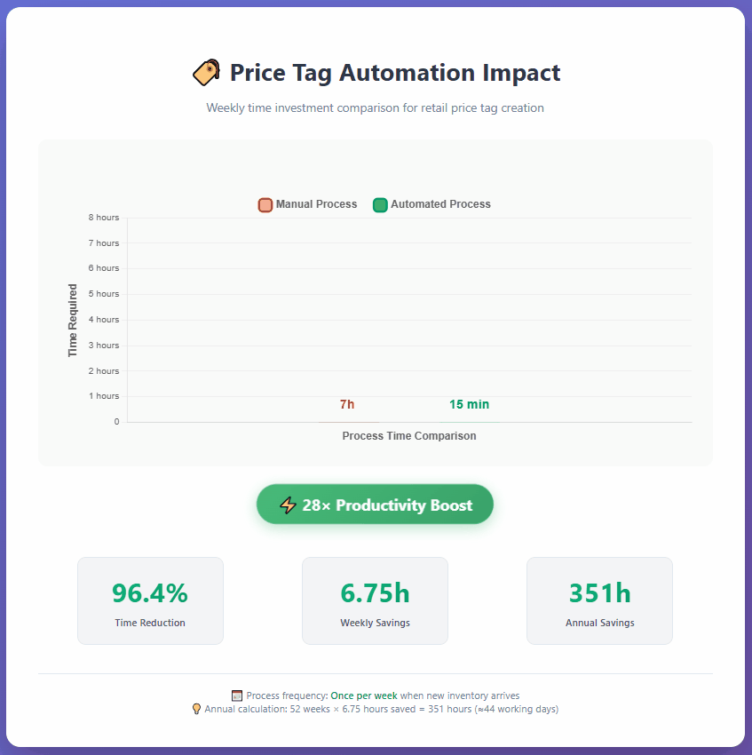
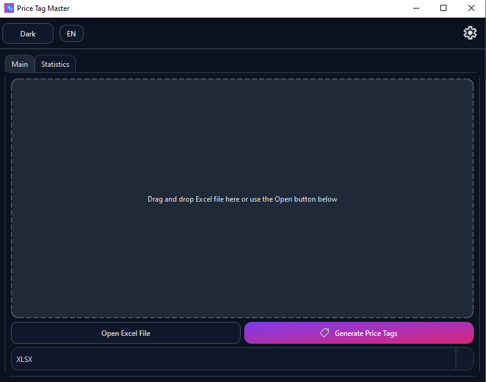
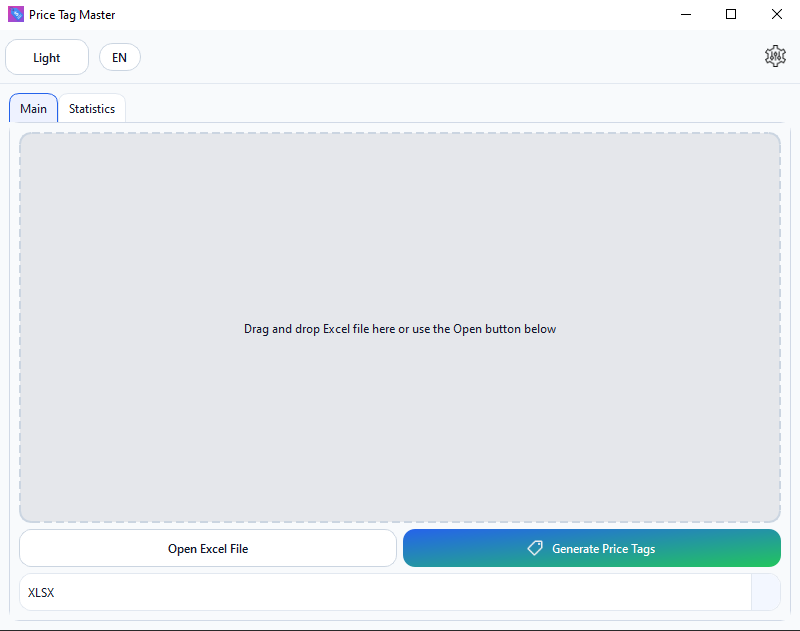
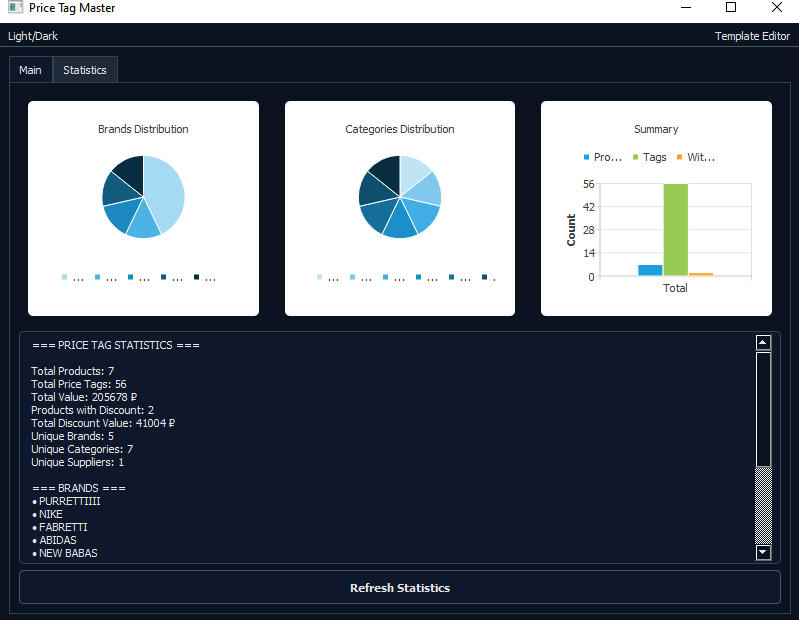
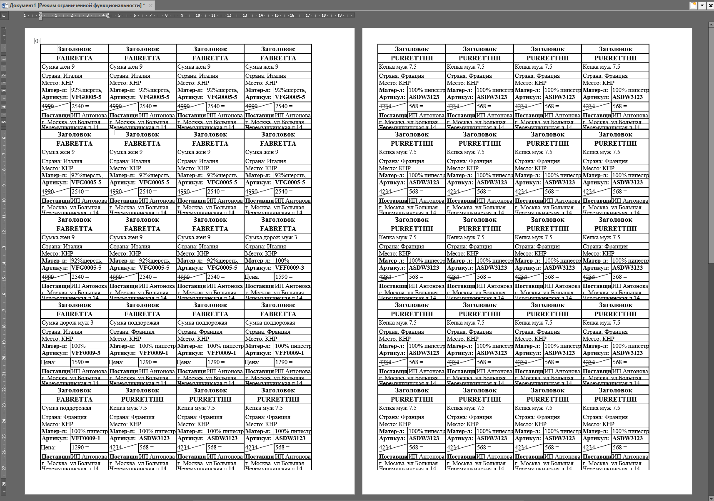
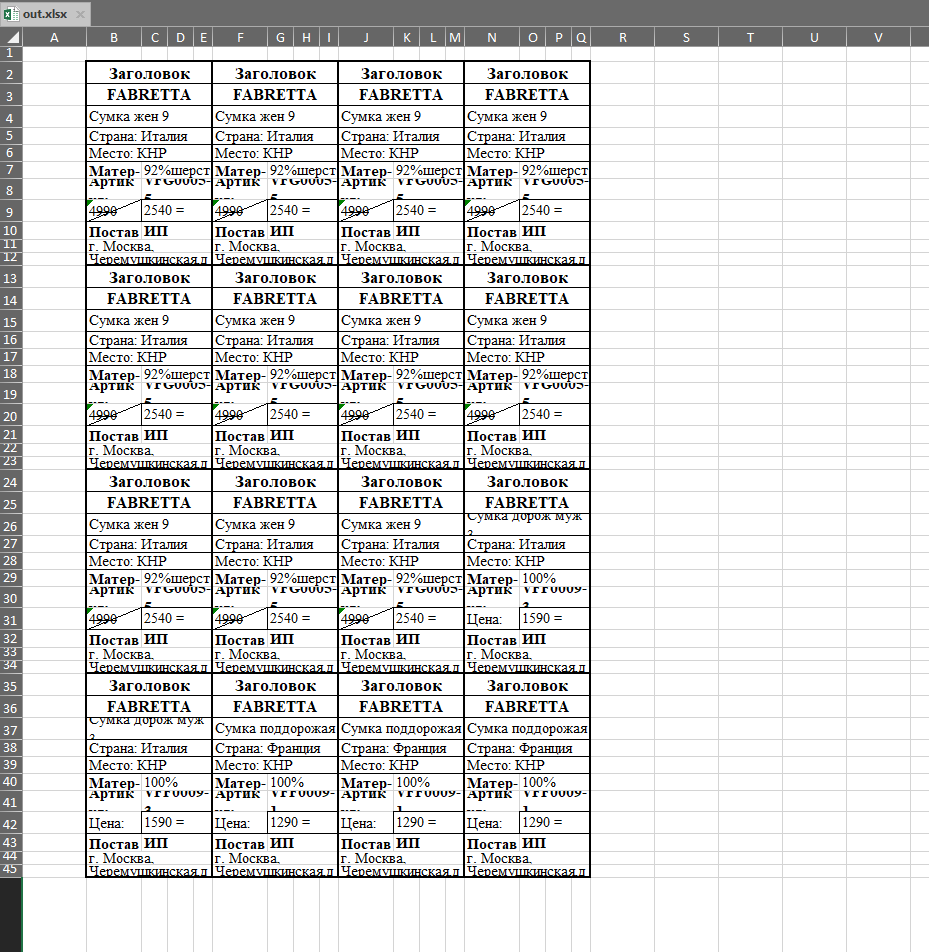
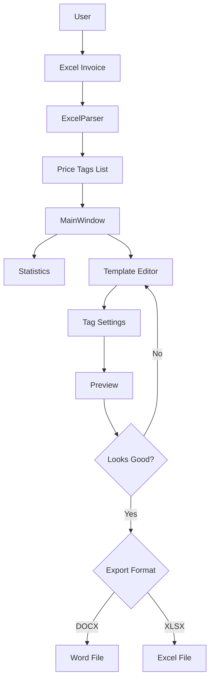

  

## Описание проблемы и решения 🎯

В розничной торговле создание ценников из товарных накладных — это рутинная задача, которая занимает 5-8 часов ручной работы в Excel или Word. PriceTagMaster автоматизирует процесс: парсит входные данные, применяет шаблоны и генерирует готовые к печати документы за секунды.

| До                                                  | После                                                                                    |
| ----------------------------------------------------- | --------------------------------------------------------------------------------------------- |
| 5-8 часов ручной верстки            | Секунды на генерацию                                                        |
| Ошибки в layout и расчетах            | Точная A4-оптимизация, без clipping                                       |
| Зависимость от ручного ввода | Автоматический парсинг с правилами (carry-down, concatenation) |

Это решает реальную бизнес-задачу для магазинов, экономя 96.4% рабочего времени в неделю. Проект создан на C++17 с Qt6 для кроссплатформенности (Windows/Linux), в модульной архитектуре и с высоким уровнем оптимизации.

## 🌟 Why PriceTagMaster is Your Must-Have App?

* **🚀 Lightning-Fast Excel Import:** Drag-and-drop your Excel file or hit "Open Excel File." The app auto-detects headers (Supplier, Price, SKU, etc.) and populates tags instantly. Supports smart carry-down rules - values inherit downward automatically!
* **🎨 Flexible Template Editor:** Design and tweak your price tag layouts: sizes, fonts, colors, margins, and even millimeter-precision geometry. Real-time preview on A4 sheets with pagination!
* **📄 Export in a Flash:** Save to DOCX or XLSX with pinpoint accuracy (within 1mm). Fully printer-compatible - no clipping or distortions!
* **🌓 Light/Dark Themes:** Toggle between light and dark modes for eye comfort. The interface adapts to your vibe!
* **📊 Stats & Analytics:** Built-in charts show brand distribution, categories, and more - great for business insights!
* **🔧 Effortless to Use:** Intuitive interface with no fluff. English UI support, data validation, and gentle error notifications.

**Perfect for:** Sellers, store managers, and anyone tired of manual price tag creation. Save time and sanity - automate the grind!

## Достижения проекта 🏆

- Решена реальная задача: автоматизация ценников для розницы.
- Метрики: 96.4% экономии времени, обработка больших файлов без сбоев.
- Технические вызовы: Точная генерация DOCX и XLSX без внешних либ, кросс-платформенный UI с темами.

### Сравнение времени на задачу ⏳

## Технические особенности 🔧

- **A4-оптимизация**: Алгоритм расчета N_cols/N_rows предотвращает clipping, используя mmToTwips для точности.
- **Кроссплатформенность**: CMake для сборки, Qt6 для GUI с темами.
- **Шаблоны**: JSON-сохранение/загрузка, редактор с live preview, актуальный для любого формата генерации ценников.
- **Производительность**: Парсинг 5k строк < 3 сек, память < 300 MB.

Использованы best practices: RAII, SOLID, clang-format для стиля.

## Инструкции по сборке 🛠️

### Требования

- C++17 компилятор (GCC/Clang/MSVC)
- Qt5.15 или Qt6 (Core, Gui, Widgets, Concurrent, PrintSupport)
- CMake 3.16+

### Сборка на Windows

1. Установите Qt6, либо Qt5.15 и CMake.
2. `mkdir build & cd build`
3. `cmake .. -DCMAKE_PREFIX_PATH="path/to/Qt6"`
4. `cmake --build . --config Release`

### Сборка на Linux

1. Установите Qt6 и зависимости: `sudo apt install qt6-base-dev libqt6widgets6 libqt6gui6 libqt6core6 cmake`
2. `mkdir build && cd build`
3. `cmake ..`
4. `make`

Запуск: `./PriceTagMaster`

## Демонстрация функционала 📋

- **Главное окно (тёмная тема):**                                                                                                                     Стартовый экран. Поддерживает drag‑and‑drop Excel, быстрый доступ к редактору шаблонов, переключение темы/языка.
- **Главное окно (светлая тема):**				

  Аналогичные элементы в светлой палитре. Контрастные акценты и подсветка зоны перетаскивания.
- **Статистика:**																	

  Сводные графики по брендам и категориям, которые были во входных данных – товарных накладных, строятся после импорта. Графики зависят от данных.

## Результат работы🏷️

- **DOCX (Word):** A4‑пагинация, единый внешний бордер тега, совпадение с предпросмотром ≤ 1 мм. Готово к печати.
- **XLSX (Excel):												**

  Заданная область печати и поля; высоты/ширины ячеек калиброваны под мм. Ничего не обрезается.

## Архитектурные решения 📐

Модульность для расширяемости: UI отделено от бизнес-логики. Выбрана Qt6 для нативного GUI, есть поддержка Qt5 версии начиная с 5.15, CMake для portability. Обоснование: фокус на производительности. Ниже — целевая схема модулей и потоков данных.

### Компоненты

- UI слой: `MainWindow`, `TemplateEditorDialog` (редактор шаблонов), `PreviewWidget` (постраничный предпросмотр).
- Модели: `PriceTag` (данные ценника), `TagTemplate` (геометрия в мм, поля, стили).
- Сервисы:
  - `ExcelParser` — чтение XLSX по именам заголовков, carry‑down Supplier/Address.
  - `LayoutEngine` — расчёт сетки A4: N_cols/N_rows, пагинация, единицы — мм.
  - `ExcelGenerator` — экспорт в XLSX через QXlsx: ширины/высоты, печатная область.
  - `WordGenerator` — экспорт в DOCX (Open XML), точное совпадение с предпросмотром.
  - `ThemeManager` — светлая/тёмная тема, QSettings.
  - `ConfigManager` — недавние файлы, последняя тема/шаблон.
- 3rd‑party: `QXlsx` (в `3rdparty/qxlsx/`), Qt6 Widgets.

### Поток данных (рантайм)

### Инварианты и единицы измерения

- Геометрия и отступы — в мм; шрифты — в pt. Единственный источник истины — `TagTemplate`.
- Формула раскладки A4: N_cols/N_rows вычисляются по габаритам ценника, полям и межстрочным/межколоночным отступам.
- Экспорты обязаны совпадать с предпросмотром с погрешностью ≤ 1 мм.

### Кросс‑срезы

- Темизация и локальные настройки — через `ThemeManager` + `QSettings`.
- Обработка ошибок парсинга — ненавязчивые баннеры в UI, продолжение с валидными данными.

Выбрана структура с фокусом на SOLID: UI отделён от бизнес‑логики, раскладка переиспользуется предпросмотром и экспортерами.

## Планы развития 📈

- Поддержка QR-кодов;
- Расширение возможностей редактирования ценников;
- Расширение наменклатуры типов входных накладных документов с товарами;
- Интеграция с БД.

## Контакты 📫

Пишите на email: neural_dog@proton.me
